# Laundry App
A simple Flutter-based laundry app with a user-friendly UI and basic calculation features.

# Features
- **User-Friendly UI**: Intuitive and easy-to-use interface for a seamless user experience.
- **Laundry Service Selection**: Choose from a variety of laundry services with descriptive icons.
- **Basic Calculation**: Implementing simple calculation features for estimated costs based on selected services.
- **Order Tracking**: Track the status of your laundry order, from pickup to delivery.

# Screenshot
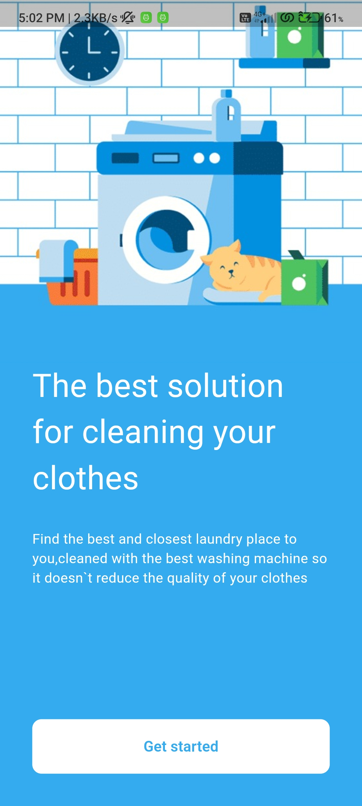
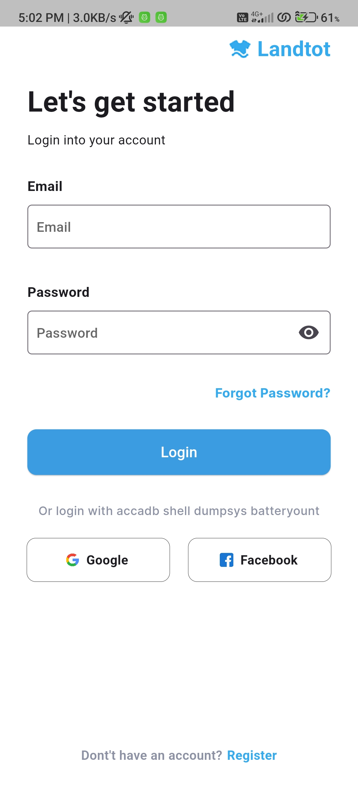
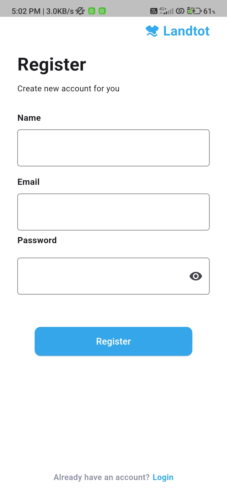
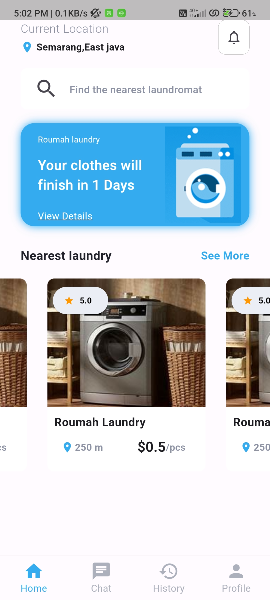
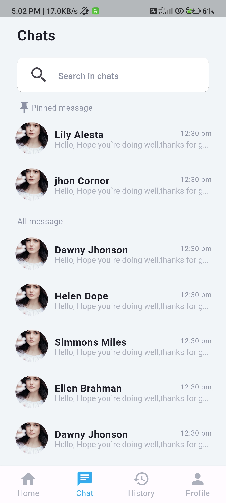
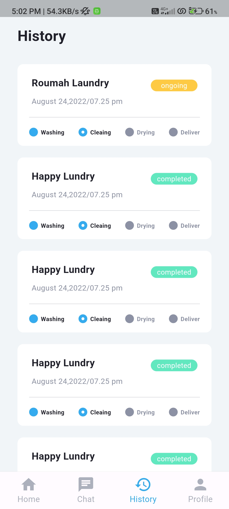
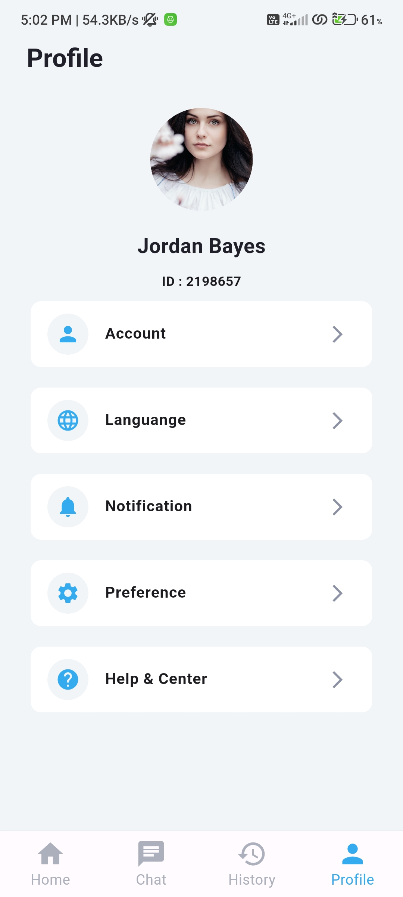
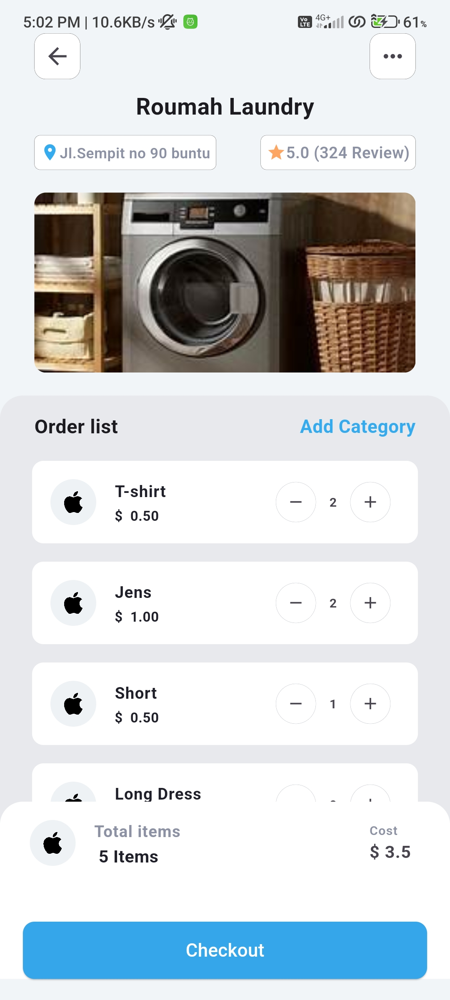
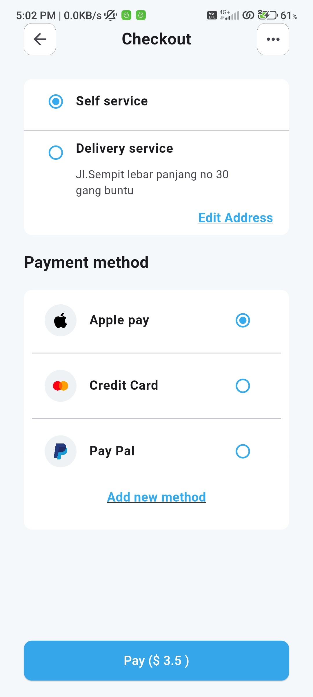
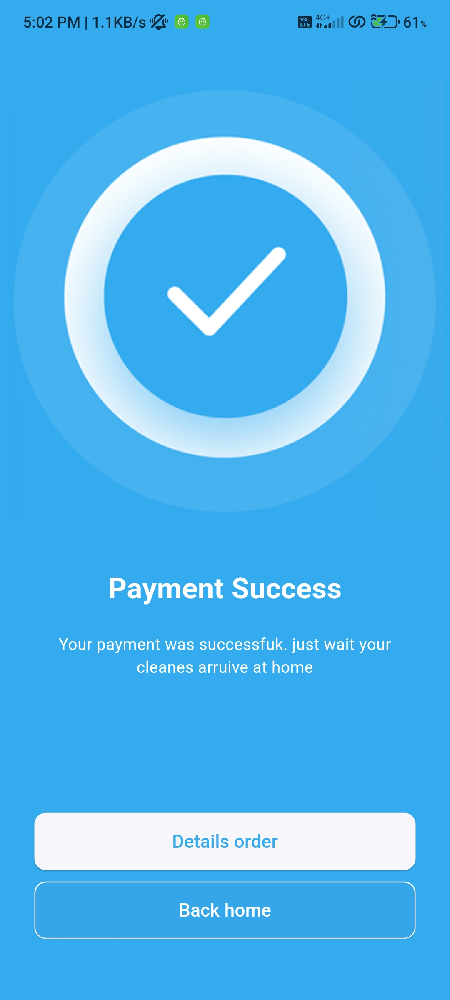
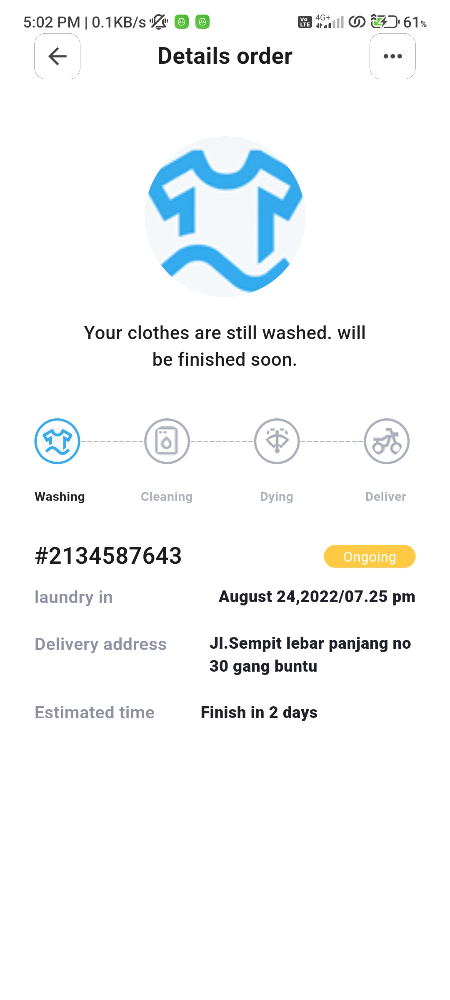
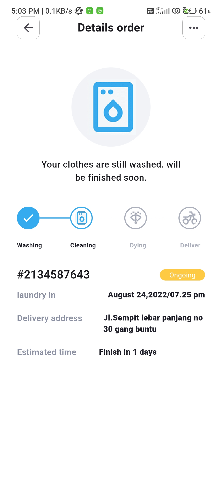
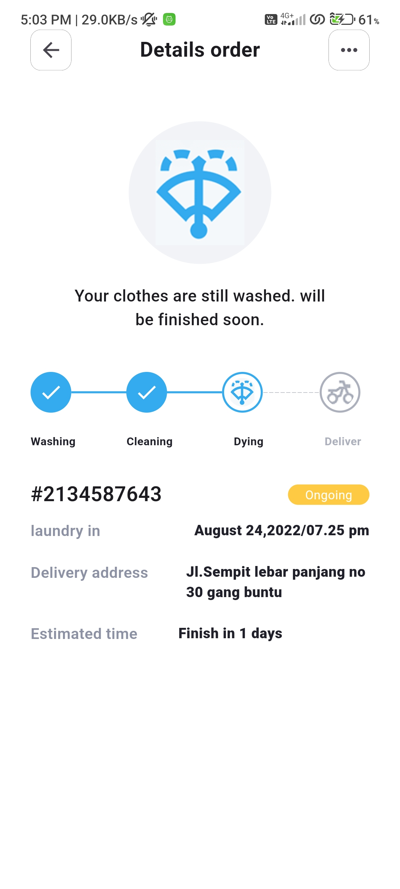
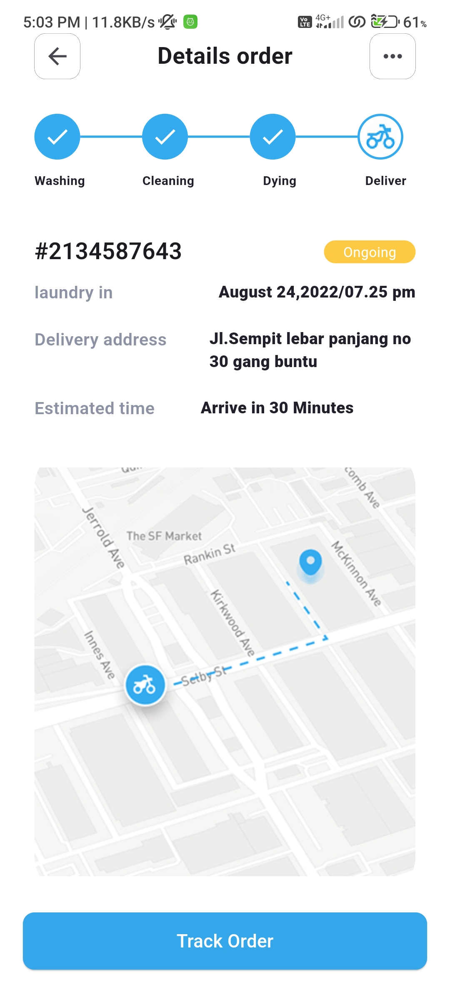
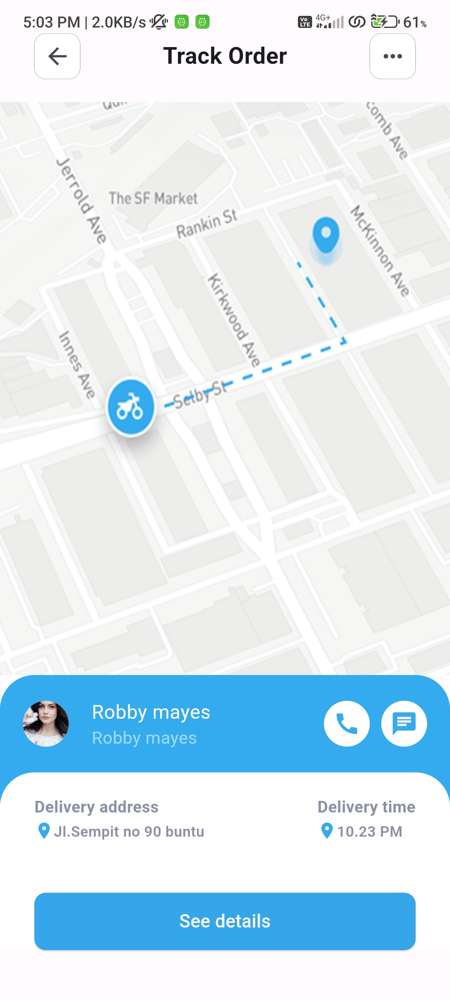